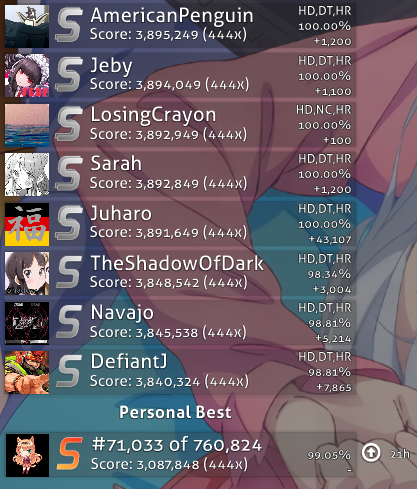

# Scoreboard

The scoarboard refers to the set of scores that you can see on the side of loved, qualified and ranked beatmaps. By default you will see the global rankings scoreboard, you can select any other of the 4 scoreboards by clicking the drop down menu which is located above the scoreboard.

## Local Ranking
The Local Ranking scoreboard contains all the scores that has been imported into osu! for a specific beatmap, along with all saved scores by simply playing the beatmap till the end without your health bar running out (No Fail scores will always be saved since you cant fail)

## Country Ranking

## Global Ranking
By default the Global Rankings scoreboard for a beatmap will be shown, it will show the top 50 plays on the beatmap (if they are available) followed by your submitted top score for the map if you have passed the map before. Note that you are requred to be signed in to be able to see the global ranking scoreboard

## Global Ranking (Specific mods)
<!-- TODO: Add descriptions + images of the scoreboards (once again ask a friend with osu supporter) -->

## Friend Ranking 
<!-- TODO: Add description + image of the friend scoreboard with scores (ask a friend with osu supporter) --> 
